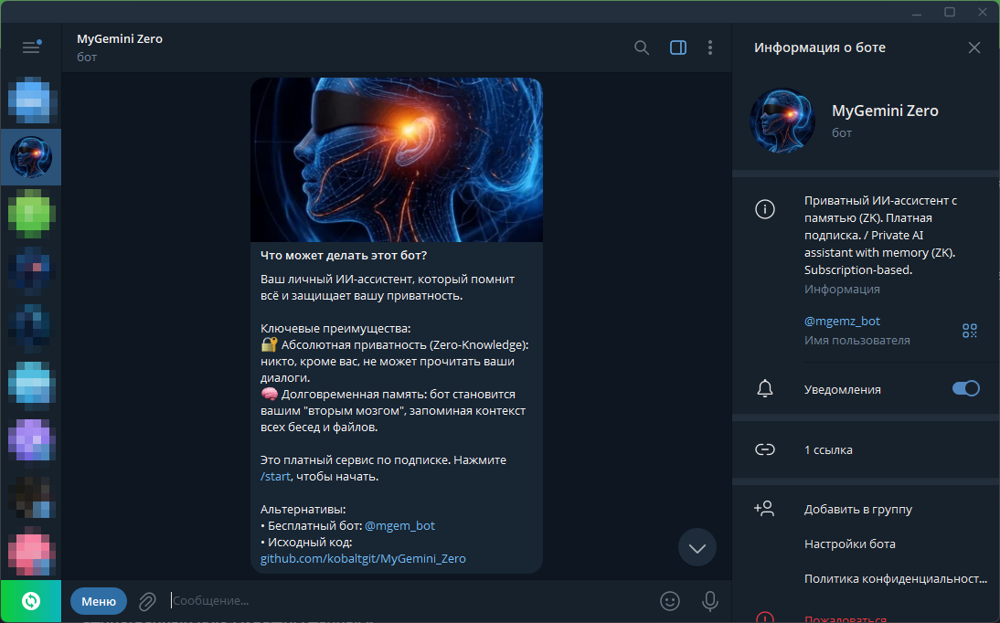
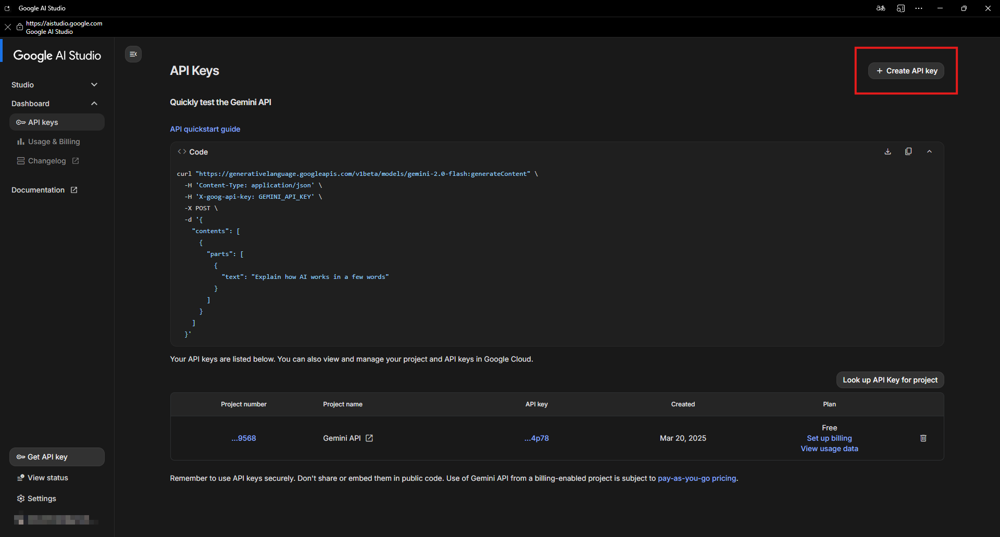
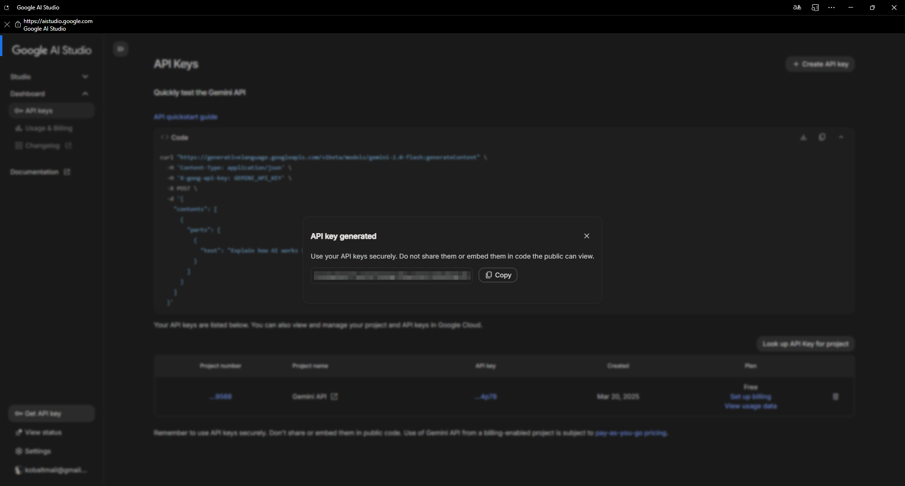

# Быстрый старт

Этот раздел поможет вам полностью настроить и запустить бота менее чем за 5 минут.

---

## Шаг 1: Первый запуск и создание мастер-пароля

Когда вы впервые запускаете бота командой `/start`, вам будет предложено оплатить подписку. После этого шага бот попросит вас создать **мастер-пароль**.

Это самый важный шаг для обеспечения вашей приватности. Этот пароль — единственный ключ к вашим данным.

!!! warning
    **Критически важно:** 
    
    Если вы забудете этот пароль, восстановить доступ к данным будет **невозможно**. У нас нет функции "сбросить пароль", так как мы не храним ваш пароль в открытом виде. Это гарантия вашей приватности. Запишите пароль и храните его в надежном месте.

После ввода пароля бот попросит вас подтвердить его, повторив ввод.

---

## Шаг 2: Заполнение профиля (Анкета)

Сразу после успешного создания пароля бот предложит вам пройти короткое анкетирование.

Это необязательный, но **очень рекомендуемый** шаг. Ответы на эти вопросы помогут ИИ-ассистенту понять, кто вы, какие у вас цели и какой стиль общения вы предпочитаете. Это основа для глубокой персонализации ответов.

Вы можете пропустить любой вопрос, отправив в ответ `-` или команду `/skip`.

---

## Шаг 3: Настройка "Пароля паники" (Опционально)

После анкеты бот предложит настроить **пароль паники**. Это дополнительная мера безопасности.

??? question "Как это работает?"
    
    Если вы введете пароль паники вместо основного, бот сделает вид, что сессия успешно разблокирована, но на самом деле немедленно и безвозвратно удалит всю вашу историю и память.

Вы можете настроить его или пропустить этот шаг.

---

## Ша-г 4: Получение и установка Google API ключа

Это финальный шаг. Для работы бота требуется ваш личный API-ключ от Google AI.

1.  **Перейдите в [Google AI Studio](https://aistudio.google.com/app/apikey).**
2.  Нажмите на кнопку **"Get API key"**.

    

3.  Скопируйте сгенерированный ключ.

    

4.  Вернитесь в Telegram и используйте команду `/set_api_key`.
5.  Вставьте скопированный ключ в ответ на запрос бота.

**Готово!** Ваш персональный ассистент полностью настроен и готов к работе. Можете начинать общение!

[Перейти к справочнику команд →](./commands.md)